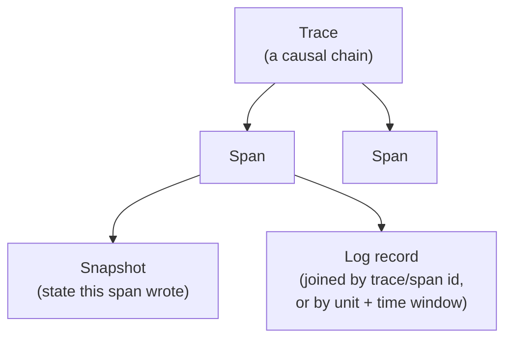

# The correlation model

The viewer's job is to answer "what happened, and why, around this
instant" — which means joining several independent kinds of captured data
back together after the fact, entirely offline. This page explains the four
concepts involved and how they connect. For where each one is populated
from, see [from wire to viewer](from-wire-to-viewer.md).

## The four concepts

- **Span** — a unit of work, one per captured Juju API RPC. Its start and
  end come from the write/read timestamps captured at the TLS boundary.
- **Trace** — a causal chain of spans rooted in some external stimulus (a
  `juju config`, a relation change on another unit).
- **Snapshot** — a state observation extracted from a span's payload: an
  application or unit status, a databag's contents at that point in time.
- **Log record** — a text observation from `juju debug-log`, Kubernetes pod
  logs, or journald.

## How the joins work, offline

- **Span ↔ span**, by trace id and parent-span id when the wire envelope
  carries them (tracing enabled upstream), or by a per-process request-id
  chain when it doesn't.
- **Log ↔ span**, by span id when the log source captured one, falling back
  to matching the log's unit and timestamp against the span's time window
  when it didn't.
- **Snapshot ↔ span**, by the id of the span that produced it.
- **Snapshot ↔ time**, by scope: to show state "as of now," the viewer
  picks the latest snapshot for that scope with a timestamp at or before
  the selected instant.

That last rule is what makes the Status pane work: application and unit
status are independent first-class snapshot scopes (an application's status
is set explicitly by its leader unit — it is not an aggregate of unit
statuses), and both are recomputed from whichever snapshot is most recent
as of wherever your cursor is in the timeline.

## See also

[The hook timeline](hook-timeline.md) applies this model concretely to
derive the Events pane's rows from raw spans.
