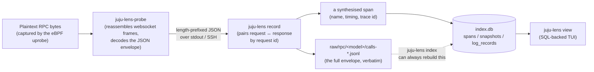

# From wire to viewer

This page traces one piece of data all the way from a TLS write inside
`jujud` to a row you can select in the viewer. For where the plaintext
comes from in the first place, see [how capture works](how-capture-works.md).

## The path

## Step by step

1. **Capture.** The eBPF uprobe copies the plaintext buffer of a
   `crypto/tls` write or read into a kernel ring buffer, without blocking
   `jujud`'s own execution.
2. **Frame decode.** `juju-lens-probe`, running in userspace, drains the
   ring buffer, strips websocket framing, and decodes the result into a
   Juju RPC envelope — the same JSON structure Juju's own `rpc/jsoncodec`
   uses on the wire, carrying a request id, a facade/method name, and the
   full request or response body.
3. **Streaming out.** The probe streams each decoded frame back to
   `juju-lens record` as length-prefixed JSON, over `stdout` (local attach)
   or an SSH channel (remote attach).
4. **Pairing.** `record` matches each request to its response by request
   id, and writes the paired result two ways: the full envelope, verbatim,
   to `raw/rpc/<model>/calls-*.jsonl`; and a synthesised **span** — `name =
   <facade>.<method>`, start = write timestamp, end = read timestamp — fed
   to the indexer.
5. **Indexing.** A background indexer batches spans (and, from their own
   independent streams, log lines from `juju debug-log`, Kubernetes pod
   logs, and journald) into `index.db`. It also classifies spans by
   `(facade, method)` to extract point-in-time state — application/unit
   status, databag contents — as **snapshots**.
6. **Viewing.** `juju-lens view` opens `index.db` read-only and never
   touches `raw/` directly; every pane is backed by a prepared SQL
   statement. See the [SQLite schema reference](../reference/sqlite-schema.md)
   for the tables involved, and the [recording layout
   reference](../reference/recording-layout.md) for what's on disk at each
   stage.

## Why `raw/` is the real source of truth

`index.db` is deliberately a cache, not a database of record: everything in
it is derivable from `raw/rpc/*.jsonl` and the log files alongside it. That
means the schema can change, or extraction logic can improve, without
invalidating old recordings — `juju-lens index` just rebuilds `index.db`
from scratch (see [how to rebuild the index](../how-to/rebuild-the-index.md)).
It also means `raw/` on its own, read with `grep` or `jq`, is a valid way to
inspect a recording if the viewer or the index can't be used for some
reason.

## When capture falls behind

Step 1's ring buffer is bounded. If a burst of activity (many units running
hooks in the same second, say) fills it faster than the probe drains it,
the oldest unread samples are dropped before the probe ever sees them.
Two things limit how often that happens, and a third makes any residual
loss visible instead of silent:

- The ring buffer is sized to absorb a short burst on its own.
- The probe's own read loop only decodes and queues frames; a separate
  goroutine does the (possibly slow) write to `record`, so a slow
  downstream write can't stall the loop draining the kernel buffer.
- If even that queue fills, the probe drops in userspace instead of
  blocking — but counts it, and reports the cumulative count to `record`
  periodically. That's the `probe reports N frames dropped so far` message
  you may see during a busy recording: it means the capture pipeline
  couldn't keep up for a stretch, not that anything crashed. A hook whose
  own closing marker was among the dropped samples shows up in the viewer
  as a "capture gap" — see [the hook timeline](hook-timeline.md).

## Where hooks and status come from

Spans alone are RPCs, not hooks — a hook is inferred by replaying a
sequence of RPCs a specific way. See [the hook timeline](hook-timeline.md)
for how, and [the correlation model](correlation-model.md) for how spans,
snapshots, and logs join to each other in general.
