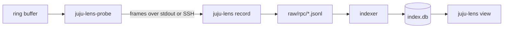

# From wire to viewer

[How capture works](how-capture-works.md) ends with plaintext bytes in a kernel ring buffer. This page follows those bytes through the processes and files that turn them into a recording on disk and an index the viewer can query. It's the same for local and SSH attach.

## The probe

`juju-lens-probe` is a separate binary that runs on the same host as the agents it observes. It drains the ring buffer and writes each captured buffer to its standard output as a *frame*: a length-prefixed JSON object holding the bytes, a timestamp, the process ID, the TLS connection the bytes belong to, and whether they were written or read.

The probe also labels each frame with the agent's identity. When it first sees a process, it reads that agent's `agent.conf` to learn the controller UUID, the model UUID, and the unit name. Frames from a unit agent therefore arrive already attributed to a unit, even if the connection's opening handshake was never captured.

With `--attach local`, `juju-lens record` starts the probe as a child process. With `--attach ssh`, it runs the probe on the remote machine through `juju ssh` and reads frames from the SSH session. Everything after this point is the same in both modes.

## The recorder

`juju-lens record` turns frames back into Juju RPC messages. A single TLS write can contain part of a websocket message or several of them, so the recorder keeps a separate decoder for each connection that reassembles websocket messages, unmasks client-to-server traffic, and decodes the JSON described in [how capture works](how-capture-works.md#what-the-plaintext-contains).

Most messages on that connection are of no interest: keepalives, address lookups, polling for values that never change. The recorder keeps a fixed list of facades and methods that carry unit and application state, hook lifecycle, relation data, leadership, secrets, configuration, and ports, and drops the rest. It drops a response whenever it dropped the matching request.

Each message it keeps becomes one line in `raw/rpc/<model>/calls-<hour>.jsonl`, with the capture time, the process and connection, the controller, model, application, and unit, and the message itself. Requests and responses are separate lines. A new file starts every hour.

While the probe runs, the recorder also collects:

- `juju debug-log` for each model in scope, into `raw/juju/`.
- Workload-container logs for Kubernetes models, into `raw/k8s/`.
- The machine journal for machine models, into `raw/machine/`.
- A `juju status` snapshot of each model at start, into `raw/status/`, so the viewer knows the state of the model before the first captured RPC.

See the [recording layout reference](../reference/recording-layout.md) for the full directory tree.

## The index

The indexer reads the raw files and writes `index.db`, a SQLite database. During a recording it runs in the background every few seconds; `juju-lens index` runs it once over a finished recording.

It pairs each request with its response by process, connection, and `request-id`, and records the pair as a *span*: a single RPC with a name (`Uniter.SetUnitStatus`), a start time (when the request was written), an end time (when the response was read), and the full request and response. When Juju's tracing is on, the span keeps the trace and span IDs from the message. Otherwise the indexer derives stable IDs from the process, connection, and request ID, so indexing the same raw files twice gives the same result.

From the spans, the indexer then works out which hook each RPC ran in and what state it changed. [From RPCs to hooks](rpcs-to-hooks.md) describes that step. Log lines go into a separate table, with their timestamp, source, unit, level, and text.

`juju-lens view` opens `index.db` read-only and never reads `raw/`. Each pane is a SQL query against the tables listed in the [SQLite schema reference](../reference/sqlite-schema.md).

Because everything in `index.db` is derived from `raw/`, the index can always be thrown away and rebuilt. A newer `juju-lens` with a different schema or better extraction can re-index an older recording, and a lost or damaged index loses no data. The raw files are plain JSON and text, so `grep` and `jq` also work on them directly. See [how to rebuild the index](../how-to/rebuild-the-index.md).

## Limitations

- **Dropped data under load.** The kernel ring buffer holds 64 MiB. If agents produce traffic faster than the probe drains it, new samples are discarded in the kernel, and nothing records that it happened.
- **Dropped frames between the probe and the recorder.** To avoid the case above, the probe never waits on the recorder: it puts frames on a queue of 4096 and lets a separate goroutine write them out. If the recorder is slow enough to fill that queue, the probe discards frames, counts them, and reports the total. The recorder prints this as `probe reports N frames dropped so far`. Data from that interval is incomplete, but the recording carries on.
- **Missing hook boundaries.** When a lost frame contained the message that marks the end of a hook, the hook appears with a *capture gap* in the viewer. See [from RPCs to hooks](rpcs-to-hooks.md#how-a-hook-run-ended).
- **Only listed RPCs are recorded.** RPCs outside the recorder's list never reach `raw/`, so re-indexing can't recover them.
