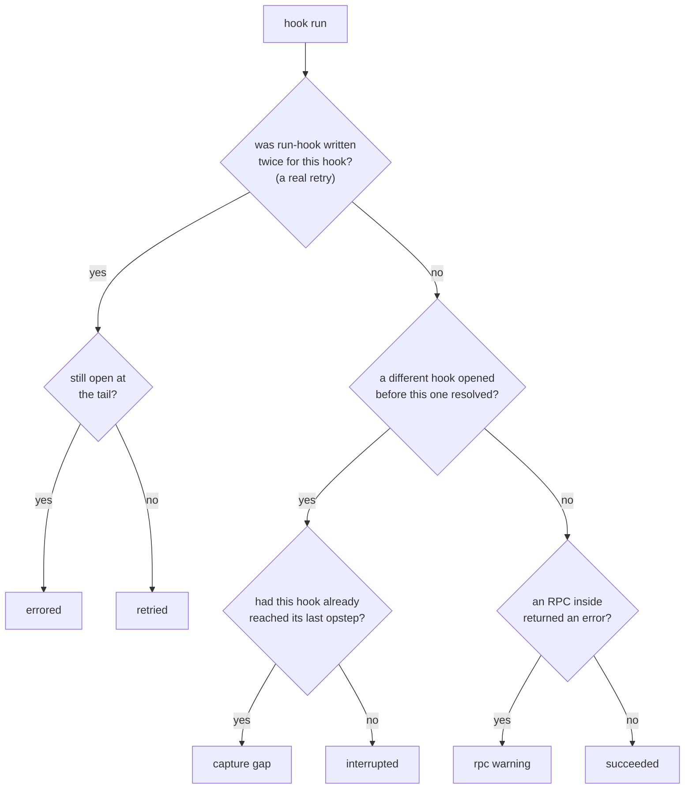

# The hook timeline

The Events pane's default view is a list of **hooks** — `install`,
`config-changed`, `grafana-source-relation-joined`, and so on — not a list
of raw RPCs. This page explains how that list is derived, and what the
verbose toggle and failure markers mean. It builds on [the correlation
model](correlation-model.md); the underlying data comes from spans as
described in [from wire to viewer](from-wire-to-viewer.md).

## Where a hook's boundaries come from

Every hook Juju runs is bracketed, on the wire, by two `Uniter.SetState`
calls the unit agent makes around its own internal `RunHook` operation: one
marking the hook as started (naming the hook and its arguments — relation
id, remote unit, storage id, and so on, depending on the hook kind), and one
marking it finished. `juju-lens` replays a unit's `SetState` calls in time
order to reconstruct these brackets, so **the exact hook identity and its
arguments are available before the charm process is even executed** —
no correlation with `juju debug-log` is required, though a corroborating
"ran X hook" log line is used as a fallback when the recorder started
mid-hook and missed the marker.

Each hook run becomes two rows in the Events pane: a start line and an end
line, both pointing at the same underlying data — so selecting either opens
the same inspector.

## Default view vs. verbose (`.`)

By default, the Events pane shows only hook rows. Everything else the raw
RPC stream carries — a bare status change, a relation scope change, a
secrets-management call — is real data, but it's a side effect *of* a hook,
not an event in its own right, so it's suppressed unless you press `.` to
toggle verbose mode. Verbose mode doesn't reload anything; it's a display
filter over the same underlying event list, and it also adds inline detail
to hook rows themselves (a running RPC count, remote unit/relation id, and
so on).

A hook also carries, inline, whatever status it drove the charm into — a
charm only ever reports status from inside a running hook, so every status
change can be attributed to the hook that caused it.

## When a hook didn't go cleanly

A hook run can end in one of a few ways. The classifier's job is to tell
"the charm is broken right now" apart from "this recording has a gap" —
two situations that look identical if you only check whether the bracket
closed. It checks, in this order:

| Outcome | What it means |
|---|---|
| Errored | Retried, and still open at the tail — the unit is in error state *right now*. |
| Retried | Retried, but it reached `continue` — it errored, Juju retried it, and the charm recovered. History, not a current problem. |
| Capture gap | A different hook opened before this one's `continue` arrived, but this one had already reached its last opstep — it almost certainly finished; only its own closing marker is missing, usually a dropped sample. |
| Interrupted | A different hook opened before this one reached its last opstep at all — usually a truncated recording or the unit being torn down mid-hook. |
| RPC warning | The bracket closed normally, but one of the RPCs inside it returned an error the charm likely caught. |
| Succeeded | None of the above. |

Only errored/retried/RPC-warning read as charm-relevant by default;
interrupted and capture gap are about the recording itself, not the charm,
so they stay in verbose mode. A hook that never retried, was never
superseded, and hasn't reached `continue` yet is simply still running — the
live tail of an in-progress recording, not a failure.

## See also

[The correlation model](correlation-model.md) for how spans, snapshots, and
logs join in general, and the [viewer keybindings
reference](../reference/viewer-keybindings.md) for every key mentioned here.
