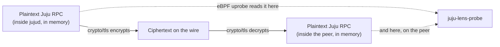

# How capture works

This page explains where `juju-lens` gets its data from, and why that
source is trustworthy even though `juju-lens` never talks to the Juju API
for it. It applies to both Juju 3.6 and 4.x, and to machine and Kubernetes
controllers alike.

## The short version

Every `jujud` process — controller or unit agent, machine or Kubernetes —
talks to its peers over TLS, using Go's `crypto/tls` package. `juju-lens`
attaches an eBPF probe to that process and reads the plaintext at the two
points where it briefly exists unencrypted inside the process: right before
`crypto/tls` encrypts an outgoing write, and right after it decrypts an
incoming read. The process is never paused, modified, or reconfigured — the
same non-invasive technique production continuous-profiling agents use, here
aimed at a protocol boundary instead of a CPU stack.

## Why this is safe to trust

The wire carries the *entire* Juju API: `Uniter.CommitHookChanges`,
`SecretsManager.*`, status setters, relation scope changes, and everything
else a charm or agent does goes through it as a JSON-over-websocket
envelope, self-describing with a request id, a facade name, a method name,
and (when tracing is configured upstream) a trace id. Reading it is
equivalent to seeing every RPC an agent makes or serves — nothing is
sampled or inferred.

It's also stable across Juju versions on purpose: `juju-lens` depends only
on `crypto/tls` (Go's standard library) and on the JSON wire format, neither
of which changes across Juju minor versions. Contrast this with the
alternative of watching the Juju API for model-change events — that
approach was tried and rejected, because Juju 4.x removed the relevant
watcher entirely. See [why the wire, not the charm or the
API](why-the-wire.md) for the full comparison.

## How the probe finds its target without help

`jujud` binaries ship stripped in production — no debug symbols. The probe
still finds `crypto/tls.(*Conn).Write`/`.Read` by reading `.gopclntab`, a
symbol table every Go binary carries regardless of stripping, and resolving
the addresses to attach to. This is the same technique used by
[`gojue/ecapture`](https://github.com/gojue/ecapture), the reference
implementation for uprobing Go TLS on stripped binaries.

## When capture runs

Only for the lifetime of one `juju-lens record` (or `watch`) invocation.
Probes attach when the recorder starts and detach cleanly on `Ctrl-C`,
`juju-lens stop`, or a configured `--max-duration`/`--max-size` limit —
there's no always-on daemon, and nothing is captured outside that window.

## What's next

Once captured, plaintext bytes still need to become the rows the viewer
shows. See [from wire to viewer](from-wire-to-viewer.md) for that path.
