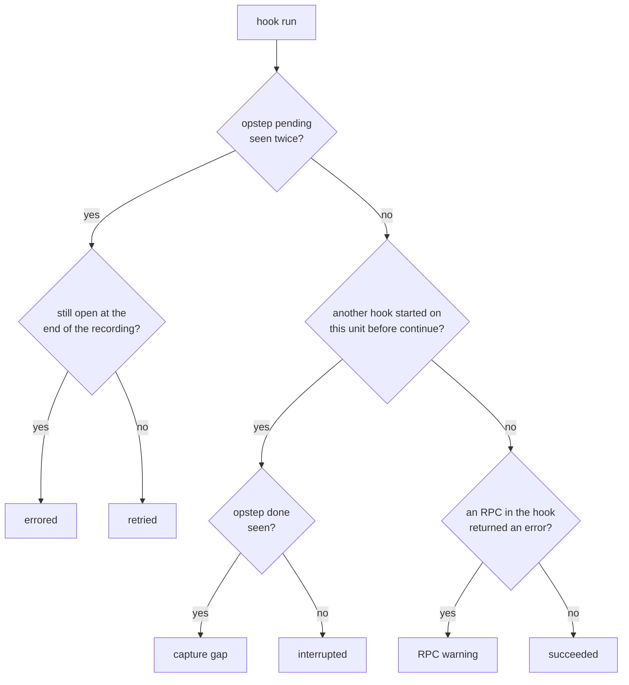

# From RPCs to hooks

A recording holds thousands of RPCs, but a charm author thinks in hooks: `install`, `config-changed`, `ingress-relation-joined`. This page describes how `juju-lens` turns spans, the single RPCs described in [from wire to viewer](from-wire-to-viewer.md), into the hooks, state changes, and log lines the viewer shows. The same rules apply to every recording, captured or synthetic; `juju-lens export` uses them too.

## Finding hooks

Before the unit agent runs a hook, it saves its current operation to the controller with a `Uniter.SetState` call. The payload is a short YAML document:

```yaml
op: run-hook
opstep: pending
hook:
  kind: relation-joined
  remote-application: prometheus
```

When the hook finishes, the agent saves its state again, this time with `op: continue`. The `run-hook` and `continue` markers bracket the hook. Any other RPC that the same unit makes between them, such as a status change, a relation-data read, or the final `CommitHookChanges`, belongs to that hook.

`juju-lens` replays each unit's `SetState` calls in time order to find these brackets. Each bracket becomes a *hook run* with the unit, the hook kind, a start and end time, and the list of spans inside it. This works without the charm's help: the agent has written down which hook it's running before the charm process has started.

The agent saves `run-hook` more than once for the same hook, as `opstep` moves from `queued` to `pending` to `done`. A `run-hook` for the hook that is already open is a step, not a new hook.

If the recording started in the middle of a hook, its opening `run-hook` is missing. `juju-lens` then falls back to grouping consecutive spans from the same unit that carry the same hook label.

The `kind` in the marker is generic: `relation-joined`, not `ingress-relation-joined`. To show the name the charm sees, `juju-lens` adds the endpoint:

- **Relation hooks:** the marker names the remote application. Other spans in the recording name the relation, as `<app>.<endpoint>#<app>.<endpoint>`, which gives the local endpoint for that pair of applications.
- **Storage hooks:** the marker carries the storage ID, such as `data/0`, and the storage name is the part before the slash.

## State changes

Some spans change state that's worth tracking over time. The indexer extracts these as *snapshots*, each with a timestamp, a scope (what it describes), and a body (the value). [The SQLite schema reference](../reference/sqlite-schema.md#snapshots) lists the fields.

| Snapshot kind | Scope | Extracted from |
|---|---|---|
| `unit-status` | A unit | `Uniter.SetUnitStatus` or `Uniter.SetStatus`: the workload status (`active`, `blocked`, ...). |
| `agent-status` | A unit | `Uniter.SetAgentStatus`: the agent status (`executing`, `idle`, ...). |
| `app-status` | An application | `Uniter.SetApplicationStatus`. The leader sets this directly; it isn't derived from unit statuses. |
| `databag` | A relation and a unit or application | `Uniter.CommitHookChanges`, which carries every relation-data write a hook made. A unit's own databag and, when the unit is the leader, the application databag. |
| `config` | An application | The response to `Uniter.ConfigSettings`. |
| `leadership` | An application | A `leader-elected` hook starting, or a unit writing the application databag. |

Each snapshot also records the span that produced it, and through that span, the hook it came from. A snapshot whose body is identical to the previous one for the same scope is marked as a repeat, so a charm that sets `active` on every `update-status` doesn't fill the timeline with changes that changed nothing.

The `juju status` taken at the start of the recording provides a first snapshot for each application and unit. Without it, a unit that stays `active` for the whole recording would have no status at all.

To show the state at a given moment, the viewer takes the latest snapshot for each scope with a timestamp at or before that moment. Moving the cursor in the Events pane updates the Status pane this way.

## What the viewer shows

The Events pane lists, by default:

- **Hook runs**, one row each, at the time the hook started. The row shows the hook name, its duration, and whether it wrote relation data.
- **Status changes**, one row each, at the time of the RPC that made the change, with the hook that caused it.
- **Settled units**, a row each time a unit's agent goes `idle` and stays there for at least three seconds. This is when a unit's status, such as `active / idle`, can be read as the result of the hooks before it.

Verbose mode (`.`) also shows the individual RPCs that the default view folds into hook rows: each status RPC, relation scope changes (`EnterScope`, `LeaveScope`), leadership claims, secret operations, and actions, plus the repeated status changes described above.

Log lines aren't tied to RPCs when they're recorded, so the Logs pane doesn't try to attribute them. It merges events and log lines from every source into one stream ordered by time and scrolls to the selected event, so the lines around it are the ones written while it happened. The exception is a log line that carries the event's span ID, which the pane marks with `»`. This only happens when tracing is enabled in Juju and the log source writes span IDs.

## How a hook run ended

Whether a hook run closed tells you very little on its own. A hook that the agent retried, a hook that the unit abandoned when it was removed, and a hook whose closing marker the probe dropped can all look the same. `juju-lens` uses the agent's own markers to tell them apart, checking each rule in turn:



**Errored**
: The agent retried the hook and it hasn't succeeded yet. The unit is in an error state at the end of the recording.

**Retried**
: The hook failed, the agent retried it, and a later attempt succeeded. A retried hook followed by an `active` status is normal.

**Capture gap**
: Another hook started before this one's `continue`, but this one had reached `opstep: done`. The hook finished; the probe lost its closing marker. See [limitations](from-wire-to-viewer.md#limitations).

**Interrupted**
: Another hook started before this one reached `done`. The recording was cut short, the agent restarted, or the unit was removed while the hook ran.

**RPC warning**
: The hook closed normally, but an RPC in it returned an error. Charms often handle these errors themselves, so this doesn't mean the hook failed.

**Succeeded**
: None of the above.

A hook that hasn't reached `continue` yet and matches none of the rules is still running. This only happens at the end of a live recording.

The default view marks errored, retried, and RPC warning hooks. Capture gaps and interrupted hooks describe the recording, not the charm, so they're only marked in verbose mode.

The same classification appears in `juju-lens export`. See [how to export a recording for an agent](../how-to/export-for-an-agent.md).
