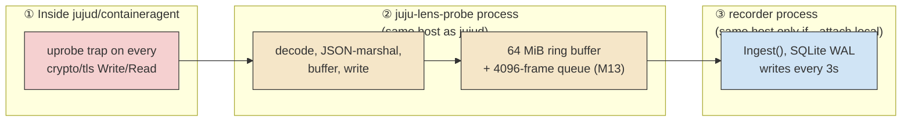

# Performance impact — estimating and measuring the cost of recording

Status: **proposed** — no implementation yet. This is a design note collecting
ideas from an investigation into `internal/probe`'s capture resilience (M13,
see [profiling-and-architecture.md §4](profiling-and-architecture.md#4-capture-resilience-under-load-m13)),
written down before anything here is built so the reasoning survives past one
conversation. Nothing in this doc is a measured number; every figure below is
either derived from published eBPF/uprobe characteristics or from real traffic
volume in one existing recording, and is flagged as such.

## 1. The question this answers

`juju-lens record` attaches eBPF uprobes to the crypto/tls boundary inside a
running `jujud`/`containeragent` process (docs/profiling-and-architecture.md
§1) and runs a probe process alongside it. Both of those are new load on
whatever host is running Juju. Before recommending this for use against a
production controller, we should be able to answer, with actual measurements
rather than a hand-wave: **how much slower does Juju get, and how much host
resource does the tooling itself consume, while a recording is active?**

## 2. Where the cost is actually incurred

The word "impact on Juju" conflates three genuinely different cost centers.
Only the first is literally inside Juju's own code path; the other two are
impact on whatever host Juju happens to share with the tooling.

**① Per-RPC uprobe tax inside `jujud` itself.** Per
`internal/probe/run_linux.go:395-420`, a `Write` call fires **one** uprobe
(entry only — the buffer's already populated at that point); a `Read` call
fires **two** (an entry uprobe that stashes the pointer, then one of several
RET-site uprobes on return — deliberately not a uretprobe, which patches the
on-stack return address and crashes Go processes, see the comment at
`run_linux.go:407-410`). So each RPC costs roughly **3 probe firings**, each
one a kernel trap plus our program body (register reads, a
`bpf_probe_read_user` copy of up to 16 KiB of plaintext). This is the only
cost center that is literally inside Juju's own execution path; everything
downstream of the ring buffer is a separate process.

**② The probe process's own CPU/memory**, co-located with the traced process
(`--attach local`, or pre-installed on the target for `--attach ssh` — today's
`ssh` attach assumes the `juju-lens-probe` binary is already on the remote
`$PATH`; it does not stage/`scp` it there, despite earlier design notes
describing that). It decodes
every captured sample, JSON-marshals it, and writes it out — real per-event
work, now buffered through a 4096-frame channel and a 64 MiB kernel ring
(M13) that themselves consume host memory. On a comfortably-resourced host
this is noise; on a small/single-node host running the controller, every
unit's agent, *and* the probe, it's real contention.

**③ Recorder-side indexing**, only relevant when co-located with Juju
(`--attach local`): SQLite WAL writes every 3s, JSON decode of every kept
envelope. A non-issue for the Juju host under `--attach ssh`, where the
recorder runs on a separate operator machine.

## 3. A rough estimate (unverified — see §4 for how to check it)

Real traffic volume, pulled from an actual recording via
`internal/viewer/dump_diag_test.go`'s `TestDumpCapture` harness (all three
models in that recording, combined): **~18,250 kept RPC spans over ~33.5
minutes**, peaking at **~79 spans in the single busiest second**. This is a
**lower bound** on true uprobe firing volume: it only counts RPCs that
survived `internal/probe/ingest.go`'s `coreMethods` allowlist, which filters
*after* capture — every discarded call (keepalives, watcher pings, etc.)
still paid the uprobe tax before being dropped.

Published uprobe overhead on modern kernels is generally low-single-digit
microseconds per firing for a simple program; ours also copies plaintext via
`bpf_probe_read_user`, adding real per-byte cost for larger payloads. Taking
**~5–15 μs/firing** as a rough band:

- Per RPC: ~3 firings × ~5–15 μs ≈ **15–45 μs** added inside `jujud`'s call
  path.
- At the observed peak (79 RPCs/s): 79 × 3 × ~10 μs ≈ **~2.4 ms of added
  latency spread across that second** — against a full CPU core, a rounding
  error, and almost certainly dwarfed by real hook execution time (hook
  durations in that same recording ran 1–12+ *seconds*, driven by charm
  script execution, not RPC latency).

**Conclusion this estimate supports**: the pure per-call kernel tax is very
likely negligible relative to normal hook execution time, even at observed
peak rates. The more plausible source of real impact is cost centers ② and
③ — aggregate host resource contention during synchronized bursts (mass
deploy/relate/scale), particularly on a resource-constrained host running
Juju and the tooling together. That's exactly the scenario M13's capture-gap
investigation already found real strain in (see
profiling-and-architecture.md §4) — so it's a reasonable place to expect
performance impact to show up too, not just capture loss.

## 4. Measurement methods, ranked by how directly they isolate the number that matters

| # | Method | Isolates | Tool | Effort |
|---|---|---|---|---|
| 1 | `bpftool prog profile` | ① — exact CPU time *inside* our eBPF programs | `bpftool`, `sysctl kernel.bpf_stats_enabled=1` | low |
| 2 | A/B hook-duration comparison | End-to-end: does a recorded deployment actually run slower | `juju-lens` itself + `juju debug-log` | medium |
| 3 | Host resource sampling during a real recording | ② — probe process CPU/RSS on the shared host | `pidstat`, `/proc/<pid>/stat` | low |
| 4 | `perf stat -p <jujud_pid>` | ① — whether attaching changes jujud's own execution profile (context-switches especially) | `perf` | low |
| 5 | Synthetic microbenchmark | ① in isolation, no real-Juju noise | a small Go program + high-res timers | medium |
| 6 | M13 drop counters | Indirect: is the *capture pipeline* keeping up | already built (`Frame.Drops`) | none |

### 1. `bpftool prog profile` — the rigorous number for the eBPF program itself

With `sysctl kernel.bpf_stats_enabled=1` set, `bpftool prog show` reports
`run_time_ns` and `run_cnt` per loaded program — a kernel-verified, exact
measurement of total time spent inside `probe_write`/`probe_read_in`/
`probe_read_ret` (`internal/probe/bpf_linux.go`), independent of anything
Go-level. `run_time_ns / run_cnt` gives real ns/firing on the actual kernel
in use, replacing the ~5–15 μs guess in §3 with a measured one. It does
**not** capture the trap overhead of entering/leaving the program — only the
program body — so pair it with #4 for the full per-call cost.

### 2. A/B hook-duration comparison using juju-lens's own output

The most directly useful method, and most of the tooling for one side of it
already exists: deploy the same bundle twice under otherwise-identical
conditions — once under `juju-lens record`, once plain — and compare hook
durations.

- Recorded run: `internal/narrative.BuildHookRuns`' `Dur` field gives exact
  per-hook timings already.
- Unrecorded run: `juju debug-log`'s `ran "X" hook` lines give start/end
  timestamps that can be diffed the same way.

Compare median/p95 hook duration between the two runs, and time-to-
`active/idle` for the whole deployment as an end-to-end summary statistic.
This is the number an operator actually cares about ("does using juju-lens
slow my deployment down"), measured as a controlled experiment rather than
inferred from a proxy.

### 3. Host resource sampling during a real recording

`pidstat -p <jujud_pid>,<probe_pid> 1` (or sampling `/proc/<pid>/stat` on an
interval) for CPU%/RSS of both the traced process and the probe, with and
without recording active, during a bursty window like a fresh deploy.
Isolates cost center ② directly.

### 4. `perf stat -p <jujud_pid>`

Before/after attach, over an equivalent workload: cycles, instructions,
context-switches. The best way to see whether attaching uprobes measurably
changes `jujud`'s own execution profile — context-switch count especially,
since each uprobe firing is a trap — decoupled from whatever the probe or
recorder do afterward.

### 5. A synthetic microbenchmark, decoupled from real Juju noise

A small Go program that calls `crypto/tls` Read/Write in a tight loop (e.g.
against a local TLS listener), timed with high-resolution timers, with vs.
without the probe attached to it. Isolates *pure* per-call trap overhead with
nothing else competing — the cleanest possible number for cost center ①,
fully repeatable, no real Juju deployment required.

### 6. The M13 drop counters as an ongoing, already-instrumented health signal

Not a performance number, but a free one: if `Frame.Drops` stays at zero
through a genuinely bursty recording, that's empirical evidence the pipeline
had headroom on that host; climbing drops is a direct, already-built early
warning that the *capture* is falling behind (not necessarily that Juju
itself is slower). Worth watching as a first, zero-effort signal before
reaching for the heavier tools above.

## 5. Recommended next step

Method #2 (A/B hook-duration comparison) is the highest-value first build:
it answers the question operators actually ask, most of the machinery
already exists in this codebase, and it needs no kernel-level tooling beyond
what `juju-lens` and `juju debug-log` already provide. A small harness that
runs the same bundle twice, pulls hook durations from both sources, and
reports the delta would turn this whole document from an estimate into a
number.

Methods #1 and #4 are the natural follow-up once a real gap shows up in #2 —
they explain *where* inside the mechanism the cost lives, rather than just
*whether* it's there.
