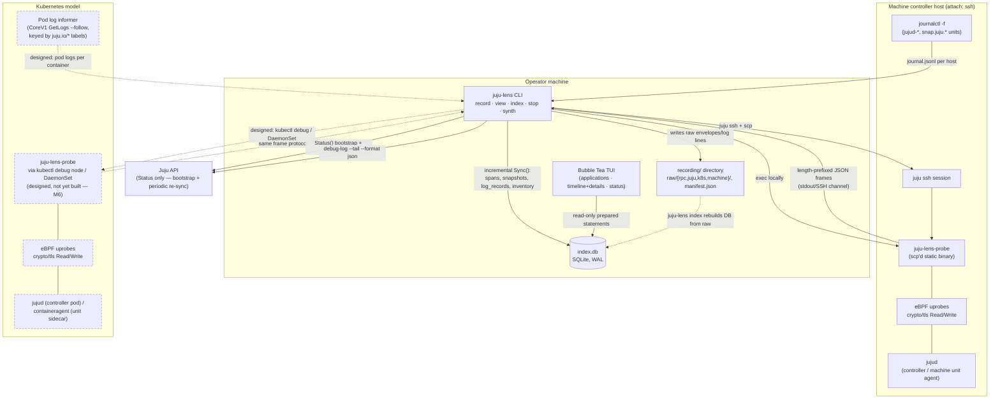
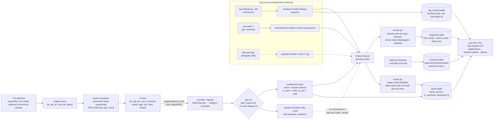

# Profiling, architecture, and data flow

This document explains how `juju-lens` captures information from a running
Juju controller ("profiling" in the eBPF sense — attaching to a live
process, not sampling CPU stacks), how the pieces fit together, and how a
byte on the wire ends up as a queryable row in the viewer.

Implemented today: `local`/`ssh` attach, RPC capture, `debug-log`/k8s
pod logs/journald ingestion, SQLite indexing, the read-only TUI.
`kubectl-debug`/`daemonset` attach (Kubernetes-native deployment of the
probe) is designed in [VISION.md](../VISION.md) but not yet built (tracked
for milestone M6) — the Kubernetes lane in the diagrams below is marked
accordingly.

## 1. What is profiled, how, and when

**What.** Not CPU/memory profiling — `juju-lens` profiles the Juju API
traffic of a `jujud`/`containeragent` process by reading its plaintext
right at the TLS boundary, before encryption on write and after decryption
on read. Every Juju API call (`Uniter.CommitHookChanges`,
`SecretsManager.*`, status setters, etc.) is a JSON-over-websocket envelope
carrying `request-id`, facade `type`, `request` method, `params`, and
`response` — so intercepting the plaintext is equivalent to seeing every
RPC the agent makes or serves, without talking to the Juju API at all.

**How.** `juju-lens-probe` resolves `crypto/tls.(*Conn).Write` and
`.Read` inside the *target's own binary* by parsing `.gopclntab` (Go's
symbol table, present even in stripped release binaries), then attaches
eBPF uprobes to those entry points with `cilium/ebpf`. Each firing uprobe
copies the plaintext buffer into a ring buffer; userspace reassembles the
raw bytes into websocket frames and JSON RPC envelopes and streams them out
as length-prefixed frames. The target process is never modified, paused,
or reconfigured — this is the same non-invasive technique production
continuous-profiling agents (Pixie, Grafana Beyla) use, applied to a
protocol boundary instead of a stack sampler.

**When.** Only for the lifetime of a `juju-lens record` invocation. Uprobes
attach when the probe starts (immediately for explicit PIDs, or
continuously as new `jujud`/`containeragent` processes appear when running
in dynamic/discovery mode) and detach cleanly on `SIGINT`/`SIGTERM`
(including `juju-lens stop`) or when `--max-duration`/`--max-size` is hit.
Nothing is captured before attach or after detach — there is no
always-on daemon.

```mermaid
sequenceDiagram
    autonumber
    participant Op as Operator
    participant Rec as juju-lens record
    participant Probe as juju-lens-probe
    participant Kern as Linux kernel (eBPF)
    participant TLS as crypto/tls.Conn (jujud)
    participant Peer as Remote peer (apiserver / unit agent)

    Op->>Rec: "juju-lens record CONTROLLER --attach local|ssh"
    Rec->>Rec: Status() bootstrap (seed inventory, app/unit status)
    Rec->>Probe: exec locally, or scp + exec over `juju ssh`
    Probe->>Probe: enumerate jujud/containeragent PIDs
    Probe->>Probe: parse .gopclntab, resolve TLS Read/Write addrs
    Probe->>Kern: attach uprobes (entry + return) on resolved addrses
    Kern-->>Probe: uprobes active

    loop for every Juju API call, until detach
        TLS->>Peer: encrypted RPC bytes over the wire
        Note over TLS,Kern: uprobe fires on Write/Read<br/>entry stashes buffer ptr, return reads byte count
        Kern->>Kern: copy plaintext into ringbuf map<br/>(ring full → sample dropped, uncounted; §4)
        Kern-->>Probe: ringbuf event (ts, pid, dir, bytes)
        Probe->>Probe: strip websocket framing, reassemble
        Probe->>Probe: queue onto frames chan<br/>(chan full → drop, counted; §4)
        Probe-->>Rec: length-prefixed JSON Frame (stdout)
        Rec->>Rec: pair request/response by request-id,<br/>write raw/rpc/*.jsonl, feed indexer<br/>(onDrops logs any counted loss)
    end

    Op->>Rec: Ctrl-C / SIGTERM / juju-lens stop / max-duration|size
    Rec->>Probe: cancel context (closes stdin/kills ssh session)
    Probe->>Kern: detach all uprobes
    Rec->>Rec: flush indexer, write manifest.json (end_reason)
```

## 2. Architecture



## 3. Data flow



## 4. Capture resilience under load (M13)

The ring buffer in step B is bounded (64 MiB — `bpf_linux.go`'s `events` map),
and the eBPF program filling it cannot block: if a burst of activity fills the
ring faster than userspace drains it, `bpf_ringbuf_reserve` fails and that
sample is gone before it ever reaches the probe — silently, with nothing for
the recording to log, since the loss happens below anything of ours. This is
the source of the occasional `capture gap` (`failLostContinue`) event the
viewer shows: a hook that genuinely ran and finished, but whose own closing
marker was one of the samples lost this way.

Two things reduce how often that happens, and a third makes residual loss
visible instead of invisible:

1. **A bigger ring** (64 MiB) absorbs a short burst — e.g. many units running
   hooks within the same second at bootstrap or scale-out — without
   `bpf_ringbuf_reserve` ever failing.
2. **A decoupled userspace reader.** `probe.Run`'s ring-drain loop used to do
   its own I/O (`WriteFrame` to `cfg.Out`) inline; if the recorder's other end
   of that pipe was busy (e.g. indexing a burst of spans to SQLite), the write
   would block, which stalled the *same* loop draining the kernel ring —
   turning a downstream slowdown directly into upstream, uncounted kernel
   drops. The drain loop now only decodes and pushes onto a buffered channel
   (`frameQueueCap`, 4096 frames); a separate goroutine (`runSink`) does the
   (possibly slow) I/O, through a `bufio.Writer` to cut the per-frame syscall
   count. A blocked sink now only backs up that channel, not the kernel ring.
3. **Counted, reported loss.** If even that channel fills — the sink is
   sustainedly, not just momentarily, too slow — the drain loop drops in
   userspace instead of blocking, but counts it (`queueDrops`). `runSink`
   periodically (`dropStatsInterval`, 2s) emits the cumulative count as a
   stats `Frame` (`Frame.Drops`, `Data` empty) into the same frame stream.
   `Ingest`'s `onDrops` callback picks it up recorder-side and (`record.go`)
   logs it to stderr as it happens and once more at the end of the recording.

What this does **not** fix: a kernel-level `bpf_ringbuf_reserve` failure
itself is still uncounted — there is no drop counter inside the eBPF program,
so loss that happens *before* userspace even sees a sample remains invisible.
The three points above only reduce how often that path is reached (bigger
ring, faster/decoupled drain) — they don't make it observable. Wiring an
in-kernel counter (a small per-CPU array map bumped on the reserve-failure
path, read out by userspace) would close that last gap, but needs care with
raw eBPF assembly (`bpf_linux.go` is hand-assembled, not compiled from C) and
is not yet done.
